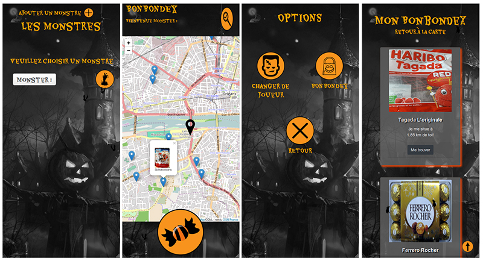

# "Bonbondex" application - Hackathon

Do you know Pokemon ? Sacha, a trainer, travels from city to city to capture animals and complete his Pokédex (Pokemon encyclopedia).

Here, it's Halloween !
You not search Pokemon but candies. Your objective: to complete your "Bonbondex" (Candies encyclopedia).

For this :
* Select or create a monster and wait few seconds
* On the map, your position is show by a black cursor
* If you are next to a blue cursor, click on its, and in the popin, click to "Je l'ai !" for to add candy in your bonbondex
* If you want move in the map, click on the magnifying glass and enter a new address



## Prerequisites

You need [Composer](https://getcomposer.org/download/) in your computer.

## Installing

* Clone the project `git clone https://github.com/Amandine1345/201810-hackathon-halloween.git`
* Open the folder, and run command `composer install`
* Rename *app/db.php.dist* to *app/db.php*, and configure the constants
```php
define('APP_DB_HOST', 'your_db_host');
define('APP_DB_NAME', 'your_db_name');
define('APP_DB_USER', 'your_db_user');
define('APP_DB_PWD', 'your_db_password');
```
* Create a new database on the local server and import the file `data/201810-Hackathon-Halloween.sql`
* Run command `php -S localhost:8000 -t public/`
* Open [http://localhost:8000/database](http://localhost:8000/database) for download API's data

### Build With

* HTML 5
* CSS 3
* Bootstrap 4
* PHP 7 / MySQL
* [OpenFoodFacts API](https://en.wiki.openfoodfacts.org/API)
* [Adresses API](https://adresse.data.gouv.fr/api)

### Versioning

* Git
 
### Contributors

* Patricia Batjorm - [PBAT75](https://github.com/PBAT75)
* Guillaume Gallier - [Guisharko](https://github.com/Guisharko)
* Mathieu Hoarau - [Mathelchrist](https://github.com/Mathelchrist)
* Teddy Milon - [milonte](https://github.com/milonte)
* Amandine Turpin - [Amandine1345](https://github.com/Amandine1345)

###### Duration of the project : 28 hours